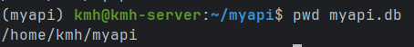
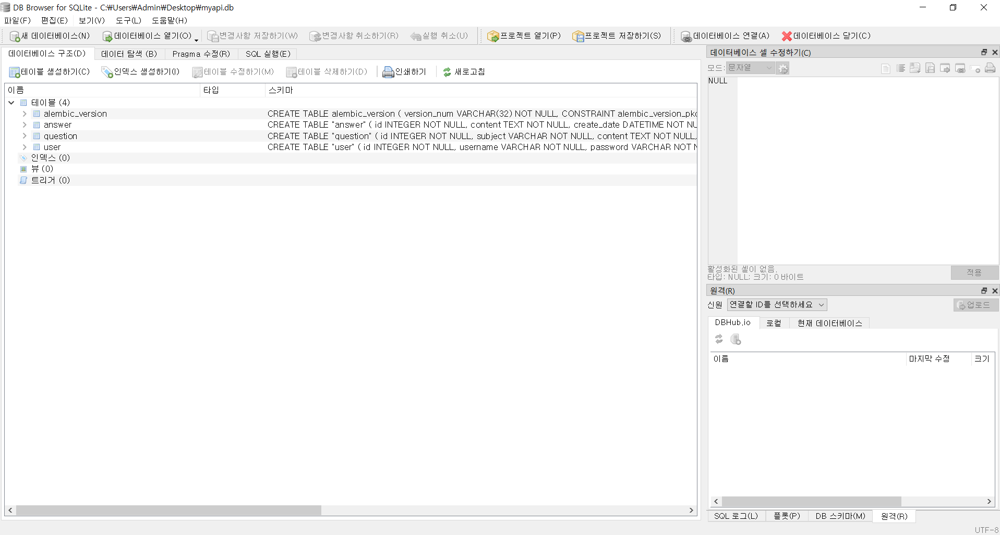

# 점프 투 FastAPI

> ## 개발환경 구성 
> - 개발환경 : VirtualBox + Ubuntu 22.04 Server
>   - 메모리 : 8GB
>   - 프로세서 : 4개 이상(pycharm, vscode 사용 때문)
>   - 비디오메모리 : 16MB
>   - 모니터개수 : 1개
>   - 저장소 메모리 : 16~25GB
>   - 네트워크 : NAT 네트워크 포트포워딩
> - 백엔드 : FastAPI (uvicorn 실행)
> - 백엔드 프레임워크 : Pycharm 
> - 프론트엔드 : Svelte (Bootstrap 5.3.6 UI 기반)
> - 프론트엔드 프레임워크 : VS Code 
> - 데이터베이스 : SQLAlchemy - SQLite
> - 배포용 GitHub Repository : khangte/fastapi_study

## 파일 구조
```
myapi/
├── domain/
│   ├── answer/
│   │   ├── answer_crud.py
│   │   ├── answer_router.py
│   │   └── answer_schema.py
│   ├── question/
│   │   ├── question_crud.py
│   │   ├── question_router.py
│   │   └── question_schema.py
│   └── user/
│       ├── user_crud.py
│       ├── user_router.py
│       └── user_schema.py
├── frontend/
│   ├── src/
│   │   ├── components/
│   │   │   ├── Error.svelte
│   │   │   └── Navigation.svelte
│   │   ├── lib/
│   │   │   ├── api.js
│   │   │   └── store.js
│   │   ├── routes/
│   │   │   ├── AnswerModify.svelte
│   │   │   ├── Detail.svelte
│   │   │   ├── Home.svelte
│   │   │   ├── QuestionCreate.svelte
│   │   │   ├── QuestionModify.svelte
│   │   │   ├── UserCreate.svelte
│   │   │   └── UserLogin.svelte
│   │   ├── app.css
│   │   ├── App.svelte
│   │   ├── main.js
│   │   └── vite-env.d.ts
│   ├── .env
│   ├── .gitignore
│   ├── index.html
│   ├── jsconfig.json
│   ├── package-lock.json
│   └── package.json
├── migrations/
│   ├── versions/
│   └── env.py
├── database.py
├── main.py
├── models.py
├── myapi.db
├── README.md
└── requirements.txt
```

---
> ## uv 가상환경
> - 가상환경 생성
> ```
> $ uv venv
> ```
> - 가상환경 활성화
> ```bash
> $ source .venv/bin/activate 
> ```

> ## Svelte 설치
> ```bash
> $ npm create vite@latest frontend -- --template svelte
> $ cd frontend
> $ npm install
> ```
> - jsconfig.json 타입스크립트 사용 안함 => false로 변경
> ```json
> 파일명: /frontend/jsconfig.json
> {
>   (...생락...)
>   "checkJs": false
>   (...생락...)
> }
> ```

---
> ## 실행코드
> - 백엔드 실행코드
> ```bash
> $ uvicorn main:app --host 0.0.0.0 --port 8000
> ```
> - 프론트엔드 실행코드
> ```bash
> $ npm run dev
> ```

---

> ## Ubuntu 내의 SQLite DB 파일을 Windows DB Browser for SQLite로 열기
> ### 방법 1: SCP로 복사(가장 간단하고 안전)
> 1. Ubuntu에서 DB 파일 경로 확인
> ```bash
> $ pwd myapi.db
> /home/kmh/myapi/myapi.db
> ```
> 
> 
> 2. Ubuntu의 IP 주소 확인
> ```bash
> $ ip a
> 127.0.0.1
> ```
> 
>
> 3. Windows CMD or PowerShell 에서 복사
> ```bash
> $ scp kmh@127.0.0.1:/home/kmh/myapi/myapi.db .
> ```
> 
> 
> 4. DB Browser (SQLite) 에서 DB 열기
> 

---

> ## MySQL 서버 사용 방법
> 1.mysql 설치
> ```bash
> $ sudo apt update
> $ sudo apt install mysql-server
> ```
> 
> 2. mysql 서버 실행 상태 확인
> ```bash
> $ sudo service mysql status
> ```
> 
> 3. MySQL 로그인
> ```bash
> $ mysql -u root -p
> ```
> ---
> ※ 에러 메시지
> ```bash
> ERROR 1698 (28000): Access denied for user 'root'@'localhost'
> => root 유저가 패스워드 인증이 아닌 
> "auth_socket" 방식으로만 로그인이 가능하도록 설정되어 있기 때문!
> > ```
> - 해결방법
> ```bash
> $ sudo mysql
> > ALTER USER 'root'@'localhost' IDENTIFIED WITH mysql_native_password BY '1234';
> > FLUSH PRIVILEGES;
> ```

- MySQL은 서버 기반 DB이기 때문에, DB가 서버 내에 직접 있어야함.
- 즉, 미리 CREATE DATABASE를 해서 DB를 생성해야됨.
```sql
CREATE DATABASE login_test CHARACTER SET utf8mb4 COLLATE utf8mb4_unicode_ci;
```

---

1. schema 생성
2. crud 함수 작성
3. router 생성
4. 라우팅 컴포넌트 App.svelte 등록
5. 컴포넌트 파일 작성
6. 